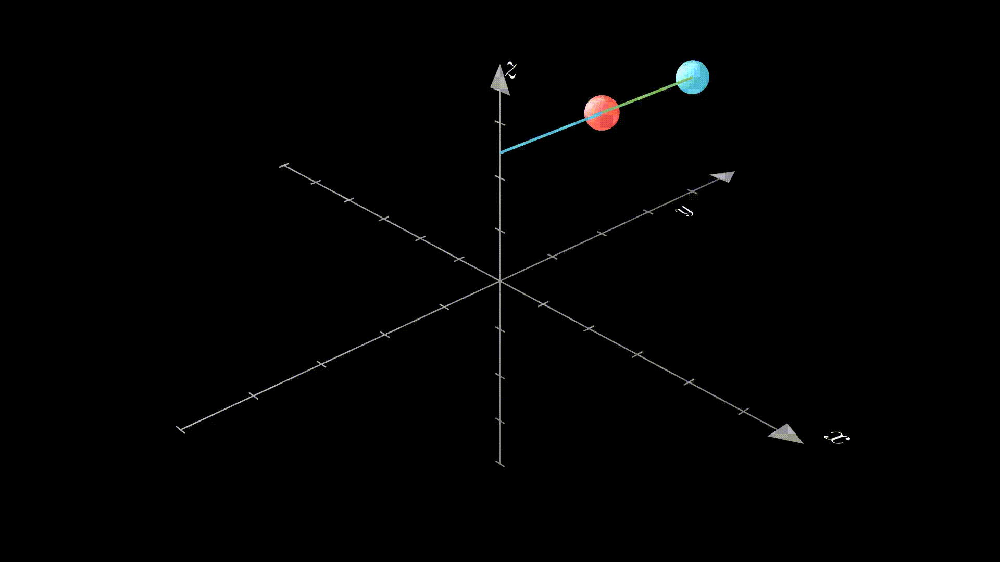

# 3D Double Pendulum in Python with Manim

This project visualizes a 3D double pendulum using the Manim library. The animation showcases the chaotic motion of the system with smooth tracing and vibrant colors. Perfect for physics simulations and mathematical visualization.

Watch the tutorial video on YouTube: [Click here](https://youtu.be/NYSHN7xX-DQ)